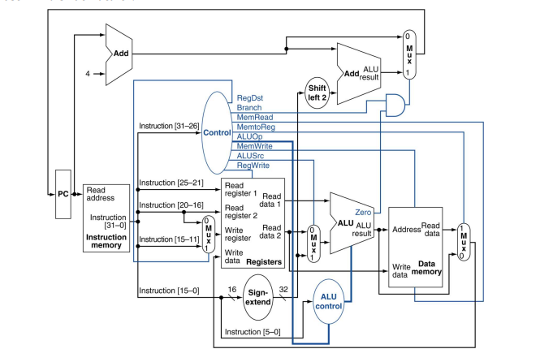

# DESIGN AND VERIFICATION OF 32-BIT 5-STAGE PIPELINE RISC CPU USING XILINX VIVADO TOOL

This is a simple RISC 32 bit processor made using Verilog.

---------------------------------------------------------------------------------------------------------------------
# Description

 * RISC Methodology.

 * Harvard Architecture.

 * 32 bit data bus.

 * 216 X 32 Data memory.

 * 216 X 32 Instruction memory.

 * 32 bit ALU.

 * 3 types of instruction set (R-type, I-type, J-type)

 * Load-store architecture.

 * 5 stage pipeline:

       1. Instruction fetch.

       2. Instruction decode.

       3. Execute.

       4. Memory access.

       5. Write back.
  -------------------------------------------------------------------------------------------------------------------
  
  -------------------------------------------------------------------------------------------------------------------
  ![MIPS32 Processor With 5 Stage pipeline] (mips.png)
# Memory

 * 216 X 32 Data memory.

 * 216 X 32 Instruction memory.
---------------------------------------------------------------------------------------------------------------------

# Register

* It has 32 Registers.
* Each Register is 32 bit wide and clock edge triggered. 
* A register bank or register file is a group of registers, any of which can be randomly accessed.
* Registers banks often allow concurrent accesses:                                                                                                                     
      - MIPS32 allows 2 register reads and 1 register write every clock cycle.
* We show various ways of designing a register bank that supports two reads and one write simultaneously:                                                               
      - It is assumed that the same register is not read and written simultaneously.
---------------------------------------------------------------------------------------------------------------------
# Instruction Set

* Used 3 types of instruction set (R-type, I-type, J-type)
* Instruction are Arithmetic, branch,load-store,call instruction.

--------------------------------------------------------------------------------------------------------------
# Assembly Program
   sample program:
 //FACTORIAL of n
 

.text

    mov r0,5              # Given Number in R0.
    mov r1,1              # Factorial of the number will be stored in R1.

.loop1:

       mul r1,r1,r0
       sub r0,r0,1
       cmp r0,1
       beq .EXIT
       b .loop1

.EXIT:

----------------------------------------------------------
* The simulation time can be varied from the test processor file.

